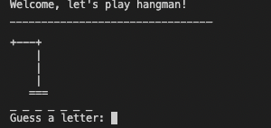
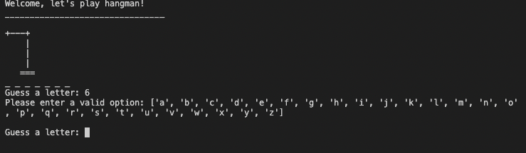
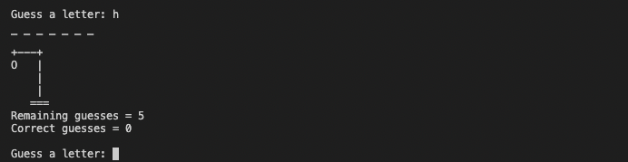
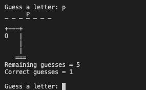
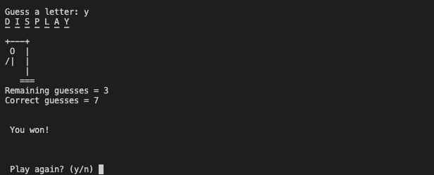
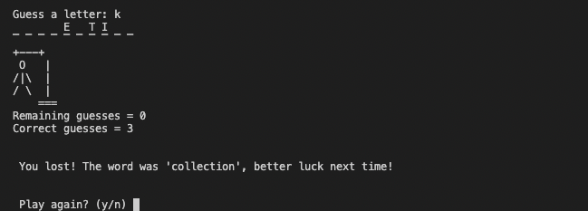
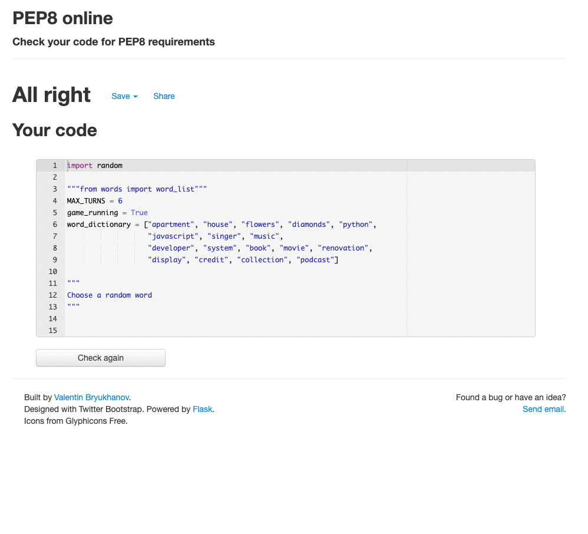

## Hangman

Hangman is a game meant to be something to pass time with, guessing letters of a word without getting the man hung.
If you guess the word correct, you win. 
If you run out of guesses and haven't gotten the correct word - you lose and the game displays a hanging man.  
It's a Python terminal game, which runs on Heroku. 
The target for this game is someone that needs a few minutes break to pass time. 

## How to play

* Player gets displayed a view of the game, and gets information to choose a letter.
* Player gets information if the guess is correct or false
* The player is displayed with a presentation of previous guesses
* The player will have a display with lines, and correct words printed.
* The player will be see the previous guess if its wrong.
* For every wrong guess there's one more attachment for the hanging man.
* After 6 guesses if word is not guessed, the player will be displayed with the correct word.
* The player will be displayed with a choise to either play a new game or finish the game. 
* If the player writes yes, or y the game starts over.
* If the player writes no the game ends. 

## Here's how the game is displayed:  

* You first get a welcome message, saying let's play!  

* You get the message with Guess a letter:  

* If you try guessing anything but a letter, you get asked to enter a valid option, and the suggestions of the letters valid,  

* If you guess the wrong letter you get displayed the amount of guesses you have left, it also displays amount of correct guesses which here shows as 0.  

* If you guess the correct word, the letter is displayed on the line for the word, and correct guesses starts counting with 1.     

* If you win the game, you get this message.   

* If you lose the game, you get this message.   

### You can either press yes or no to either restart the game or end the loop.  

## Created the Heroku app

* I created the app using following steps:  
* I added two buildpacks from the _Settings_ tab. The ordering is as follows:

1. `heroku/python`
2. `heroku/nodejs`

You must then create a _Config Var_ called `PORT`. Set this to `8000`

## Inspiration and doc of text:

### Kite on youtube

[Kite on Youtube](https://www.youtube.com/watch?v=m4nEnsavl6w) - Kite's youtube channel, and the video of inspiration here. 

### Shaun Halverson on youtube

[Shaun on YouTube](https://www.youtube.com/watch?v=pFvSb7cb_Us&t=71s) - Shauns youtube channel, and the video of inspiration here.

## Hangman symbols

### Credit for the symbols for hanging man from Chris Horton on github

[Symbols](https://gist.github.com/chrishorton/8510732aa9a80a03c829b09f12e20d9c) - I got the symbols for hangman from here.

## Testing and deploying

### Testing thru the Pep8 website 

[Pep8](http://pep8online.com/) - I tested my Python code here for validation, displayed no errors.  
. 

## Future additions.   

* Due to loosing a week i decided to skip some features because of lack of time. 
(I got notification of extension only a day before deadline when my game was completed)
* If i would have proceded with the extension i would have:  
* Added a step before game start to enter user name
